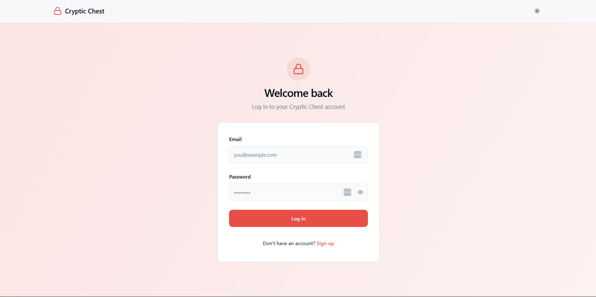
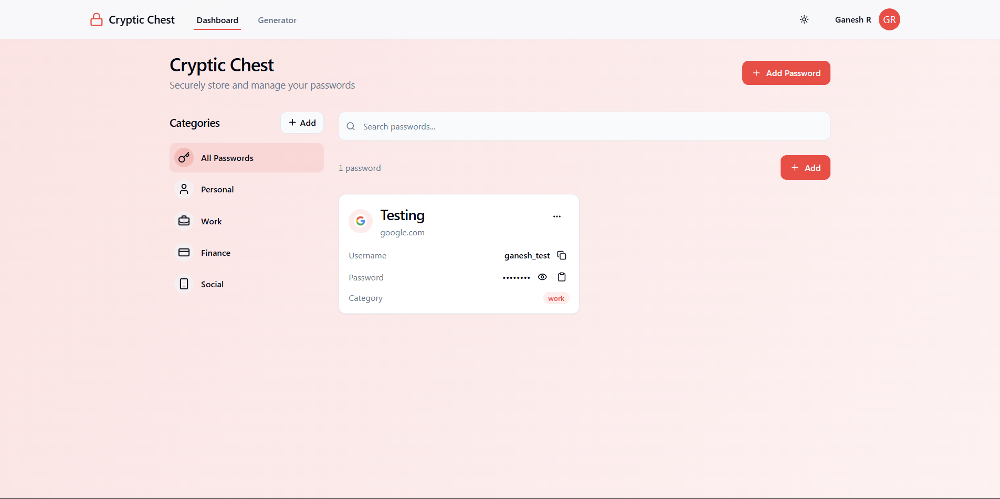

# Cryptic Chest V2 - Secure Password Manager




## Project Description

Cryptic Chest V2 is a secure, modern password management application that allows users to safely store, organize, and manage their passwords and sensitive information. This version features MongoDB integration for reliable cloud storage and robust security measures.

## Features

- **Secure Password Storage**: All passwords are encrypted before storage in MongoDB
- **MongoDB Integration**: Cloud-based storage for reliable access across devices
- **User Authentication**: Secure login and registration with JWT authentication
- **Password Categories**: Organize passwords by categories
- **Password Generator**: Create strong, unique passwords with customizable options
- **Backup & Restore**: Export and import encrypted backups of your passwords
- **Dark/Light/OLED Themes**: Choose your preferred visual style
- **Color Scheme Options**: Customize the UI with various accent colors
- **Account Management**: Change password, delete account, reset data
- **Mobile-Responsive Design**: Optimized for all device sizes

## Technology Stack

### Frontend
- **React 18**: A JavaScript library for building user interfaces
- **TypeScript**: Provides static type checking for enhanced code quality
- **Vite**: Fast and modern build tool for frontend development
- **React Router**: For application routing and navigation
- **Framer Motion**: For smooth animations and transitions
- **Axios**: For API communication

### Backend
- **Node.js**: JavaScript runtime for server-side code
- **Express**: Web framework for Node.js
- **MongoDB**: NoSQL database for password storage
- **Mongoose**: MongoDB object modeling for Node.js
- **JWT**: JSON Web Tokens for secure authentication
- **bcrypt.js**: For password hashing

### UI Components
- **shadcn/ui**: A collection of reusable UI components built with Radix UI
- **Tailwind CSS**: Utility-first CSS framework for rapid UI development
- **Lucide React**: Icon library with a clean and consistent design
- **Sonner**: Minimal toast notifications

## Data Storage & Security

### Password Storage
All password data in Cryptic Chest V2 is stored in MongoDB with robust security measures:

1. **Encryption**: Passwords are encrypted on the client-side before being sent to the server
2. **User Isolation**: Each user's passwords are associated with their unique user ID
3. **JWT Authentication**: All API requests require valid JWT tokens for access

### Encryption Implementation
The application implements a reliable encryption system:

1. **Client-Side Encryption**: Passwords are encrypted in the browser before transmission
2. **Unique Keys**: Each user has a unique encryption key derived from their credentials
3. **Zero-Knowledge Design**: The server never has access to unencrypted passwords

### Backup & Restore
- **Encrypted Backups**: Export your passwords as an encrypted JSON file
- **Recovery Phrases**: Each backup is protected with a unique recovery phrase
- **Cross-Device Support**: Restore your passwords on any device

## Getting Started

### Prerequisites
- Node.js 18+ and npm
- MongoDB (local instance or MongoDB Atlas)

### Installation

```sh
# Step 1: Clone the repository
git clone https://github.com/yourusername/Cryptic_Chest_V2.git

# Step 2: Navigate to the project directory
cd Cryptic_Chest_V2

# Step 3: Install frontend dependencies
npm install

# Step 4: Navigate to the server directory
cd server

# Step 5: Install server dependencies
npm install

# Step 6: Start the backend server
npm run dev
```

Open a **new terminal** for the next steps:

```sh
# Step 7: Navigate back to the root directory
cd ..

# Step 8: Start the frontend development server
npm run dev
```

Ensure that your MongoDB server is running in a separate terminal or as a background service.

The application will be available at http://localhost:8080 and the API server will run on http://localhost:5000.

## Environment Setup

The server expects a `.env` file in the server directory with the following variables:

```
PORT=5000
MONGODB_URI=mongodb://127.0.0.1:27017/cryptic_chest_v2
JWT_SECRET=your_jwt_secret_key
```

Note: For security in production environments, you should never commit real secrets to your repository.

## API Routes

### Authentication
- `POST /api/auth/register`: Register a new user
- `POST /api/auth/login`: Login a user
- `GET /api/auth/current-user`: Get the current authenticated user
- `POST /api/auth/change-password`: Change user password
- `POST /api/auth/recover`: Reset password using recovery phrase
- `POST /api/auth/delete-account`: Delete a user account

### Passwords
- `GET /api/passwords`: Get all passwords for the authenticated user
- `POST /api/passwords`: Create a new password
- `PUT /api/passwords/:id`: Update a password
- `DELETE /api/passwords/:id`: Delete a password
- `DELETE /api/passwords/user/:userId`: Delete all passwords for a user
- `GET /api/passwords/search`: Search passwords by query
- `GET /api/passwords/category/:category`: Filter passwords by category

## Contributing

1. Fork the repository
2. Create your feature branch (`git checkout -b feature/amazing-feature`)
3. Commit your changes (`git commit -m 'Add some amazing feature'`)
4. Push to the branch (`git push origin feature/amazing-feature`)
5. Open a Pull Request

## License

This project is licensed under the MIT License - see the LICENSE file for details.

## Acknowledgments

- Icons by [Lucide](https://lucide.dev/)
- UI components from [shadcn/ui](https://ui.shadcn.com/)
- Animation by [Framer Motion](https://www.framer.com/motion/)
